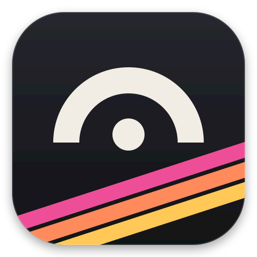
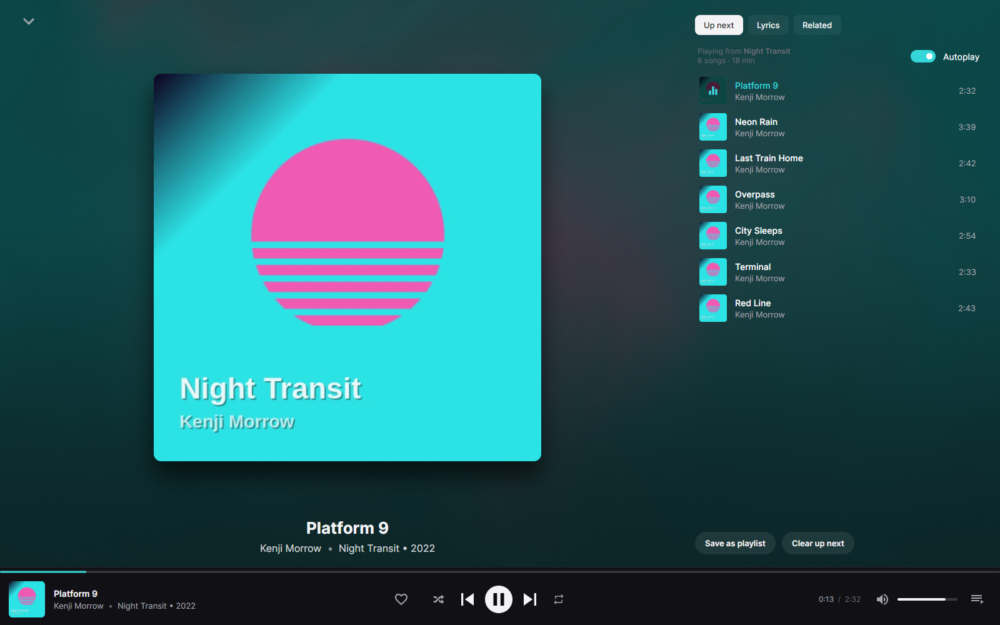
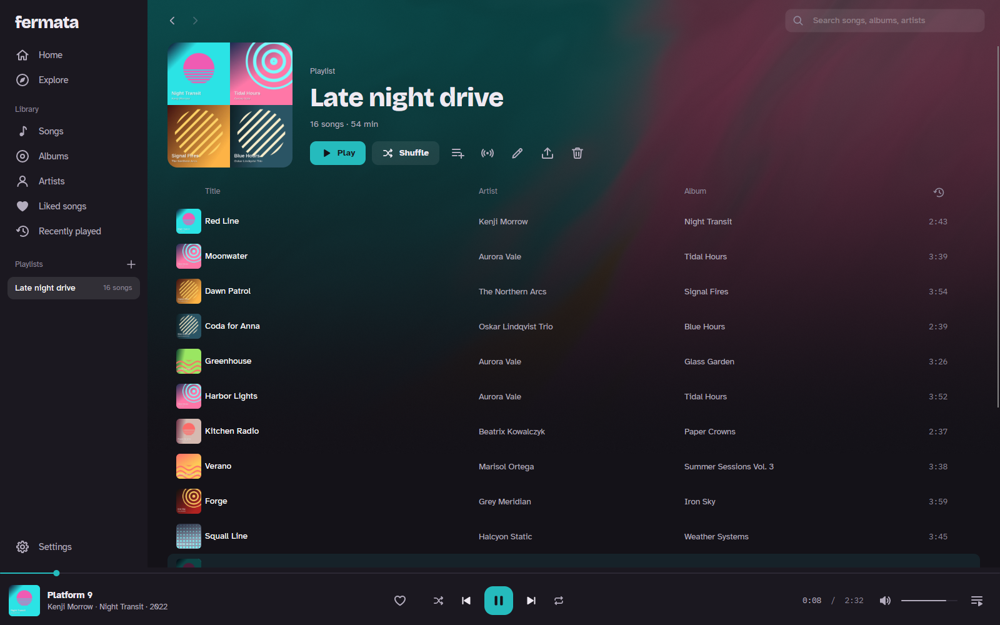
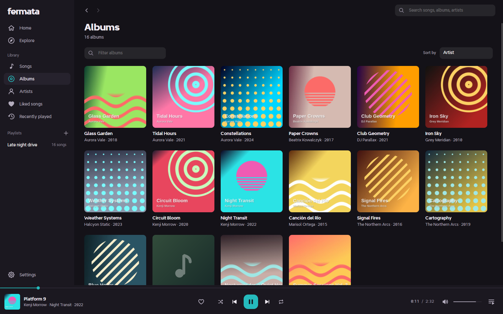

# Fermata

[](https://github.com/camelCase12/fermata/actions/workflows/ci.yml)

A music player for Linux, for the music files you already have. It's written in C# with Avalonia
and compiled to a native binary, so it starts fast and sits at basically zero CPU when you're not
doing anything.

It has a home page with mixes, radio, a queue you can edit, lyrics, playlists, likes and history.
Shuffle plays songs in the order the queue shows them.



The background and the accent color come from the cover of whatever's playing.





(The music in these screenshots is free to share: Broke For Free and Lobo Loco under CC BY 3.0, and Komiku,
Monplaisir and Loyalty Freak Music under CC0. All of it is on the [Internet Archive](https://archive.org).)

## Installing

Fermata runs on x86-64 Linux with glibc 2.35 or newer, which covers Ubuntu 22.04 and later, Debian 12,
Fedora, Arch and openSUSE. It plays through libmpv, which you install from your distribution:

| | |
| --- | --- |
| Arch | `pacman -S mpv` |
| Debian 12, Ubuntu 24.04 and later | `apt install libmpv2` |
| Ubuntu 22.04 | `apt install libmpv1` |
| Fedora | `dnf install mpv-libs` |
| openSUSE | `zypper install libmpv2` |

It also needs the X11 libraries any desktop already has, including libICE and libSM.

Download the tarball from the [latest release](https://github.com/camelCase12/fermata/releases/latest),
unpack it and run `./install.sh`. That puts Fermata in `~/.local` with a launcher entry, and
`./install.sh --uninstall` takes it back out. By default it reads your `~/Music` folder. You can change
that in Settings.

It runs on X11, and on Wayland through XWayland, where it matches each monitor's scale. To pick a scale
yourself, set `AVALONIA_GLOBAL_SCALE_FACTOR` (for example to `1.5`).

You can also control it from the command line:

```sh
fermata song.flac some-folder/   # plays them in the window that's already open
fermata --play-pause             # also --next, --previous, --stop
```

Media keys work too.

## Building

You need the .NET 10 SDK and clang. `global.json` selects the newest .NET 10 SDK installed, even when a
newer major version is installed too.

```sh
./build.sh          # builds bin/fermata/fermata
./build.sh test     # builds, then runs the checks
./install.sh        # installs the build into ~/.local
```

## Keys

| | |
| --- | --- |
| Play / pause | `Space` or `K` |
| Next / previous | `Ctrl+→` / `Ctrl+←`, or `Shift+N` / `Shift+P` |
| Skip back / forward 10 s | `J` / `L` |
| Skip back / forward 5 s | `←` / `→` (outside lists) |
| Volume, mute | `Ctrl+↑` / `Ctrl+↓`, `M` |
| Shuffle, repeat | `S`, `R` |
| Like the current song | `F` |
| Now playing | `Q` |
| Search | `Ctrl+F` or `/` |
| Back / forward | `Alt+←` / `Alt+→` |
| Home, Explore, Songs, Albums, Artists, Liked songs, Recently played | `Ctrl+1` … `Ctrl+7` |
| Settings | `Ctrl+,` |
| Play the selected song | `Enter` |
| Remove the selection from a playlist or the queue | `Delete` |
| Move the selected song in a playlist or the queue | `Alt+↑` / `Alt+↓` |
| Quit | `Ctrl+Q` |

## Notes

Fermata never writes to your music files and never connects to the internet. Settings, playlists and
likes live in `~/.config/fermata` and `~/.local/share/fermata`. If one of those files is ever damaged,
Fermata renames it with `.unreadable` and the date added, starts without it, and tells you.

The interface is in English only for now.

If you're curious how it works, or want the test and benchmark details, see [DESIGN.md](DESIGN.md).

## Reporting bugs

Open an [issue](https://github.com/camelCase12/fermata/issues) with what you did, what happened and your
distribution. If Fermata crashed, attach `~/.local/state/fermata/crash.log`.

## License

MIT. See [LICENSE](LICENSE), and [THIRD-PARTY-NOTICES.md](THIRD-PARTY-NOTICES.md) for the libraries
Fermata uses.
